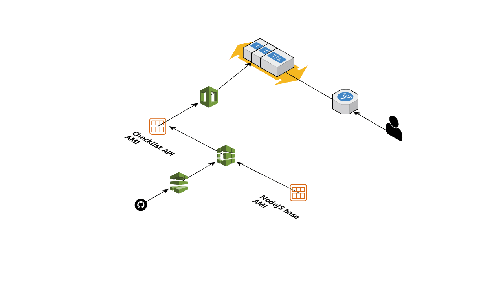

# aft-api

## Architecture

## Scripts
The [`scripts/`](scripts/) directory contains various scripts which should be
ran manually on a local machine:
* [`pipeline.sh`](scripts/pipeline.sh) - this script updates the
[CloudFormation template](ci/codepipeline.yml) which defines the CodePipeline
* [`set-avwx-token.sh`](scripts/set-avwx-token.sh) - this script updates
a Parameter Store entry with a token used to authenticate requests to AVWX
* [`airport-data/generate.js`](scripts/airport-data/generate.js) - this Node.js
script is used to generate the airport data (uses the CSV files from
[Our Airports](https://ourairports.com/data/))

## Monitoring
Monitoring is done using [Grafana](https://edge.alexchesters.com/grafana/d/OxXXMitVz/api).

## Accessing the running server
`sh scripts/ssh.sh`
